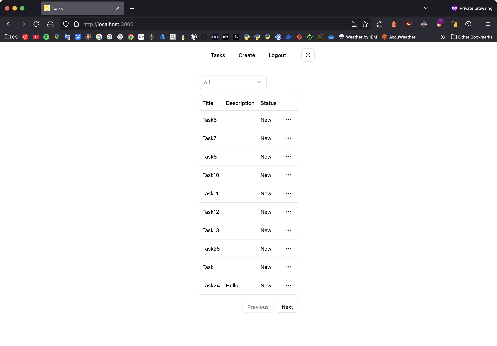
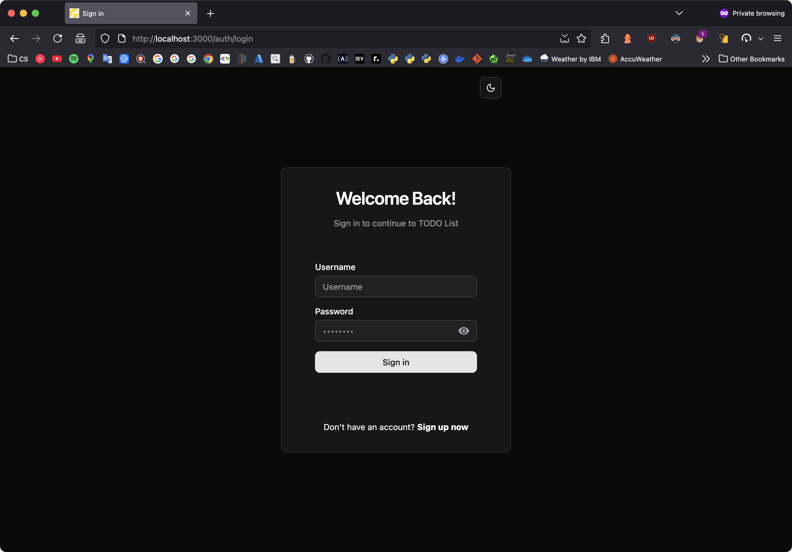
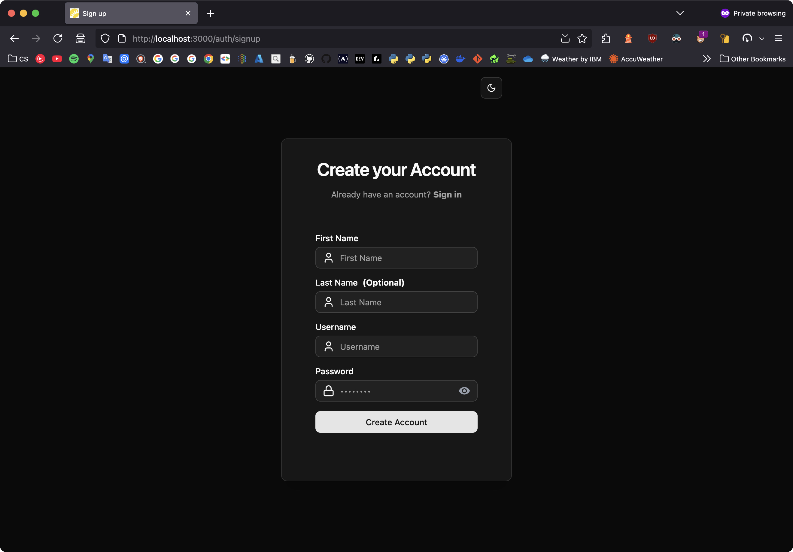
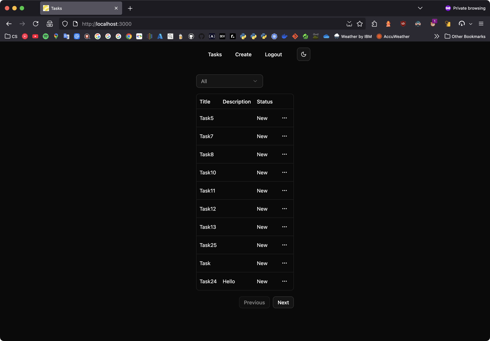
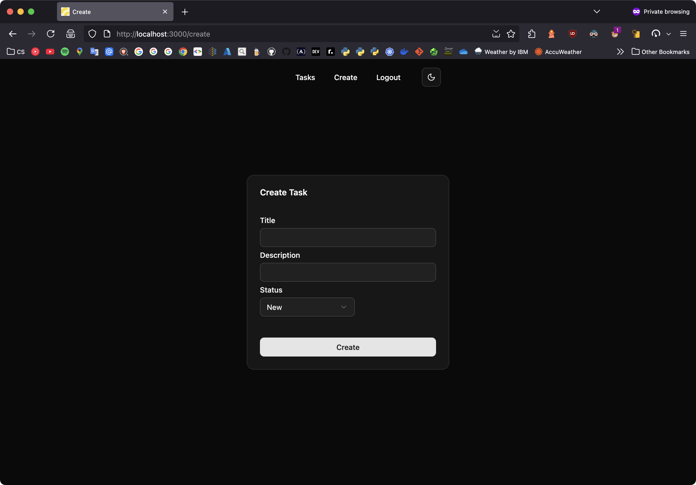
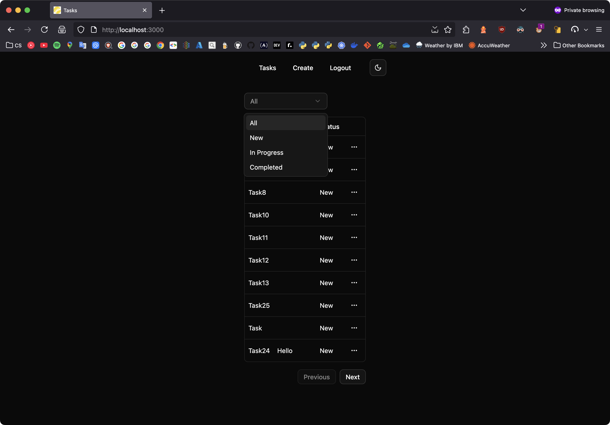

# 📝 Andersen TODO List



A minimal Django + DRF backend for personal task management with JWT auth — now with a modern SvelteKit frontend.

---

## ⚙️ Tech Stack

- **Django 5.2**
- **Django REST Framework**
- **PostgreSQL**
- **JWT Auth (SimpleJWT)**
- **Docker + Docker Compose**
- **Gunicorn** (production-ready HTTP server)
- **pytest + pytest-django**
- **django-environ**
- **django-cors-headers**
- **SvelteKit + TypeScript + Bun**
- **iconify/svelte**, **shadcn‑svelte**, and **bits‑ui** for UI components
- **Light/Dark** mode support

---

## 🚀 Features

| Feature            | Description                                             |
| ------------------ | ------------------------------------------------------- |
| 🔐 JWT Auth        | Register, login, refresh tokens (access & refresh)      |
| 👤 User Accounts   | Custom user model, separate app                         |
| ✅ Task CRUD       | Create, read, update, delete tasks (owner-only)         |
| 📊 Filter & Status | Filter tasks by `"New"`, `"In Progress"`, `"Completed"` |
| 📄 Pagination      | DRF pagination (`PAGE_LIMIT = 10`)                      |
| 🌐 Svelte Frontend | Fully SSR-capable frontend with secure HttpOnly cookies |
| 🎨 UI Components   | Built with shadcn‑svelte & bits‑ui                      |
| 🐳 Docker Support  | Dev & test containers                                   |
| 🧪 Test Suite      | `pytest` for backend (also runnable inside Docker)      |

---

## 🧬 Project Structure

```
.
├── config/             # Django settings, URLs, ASGI/WGI
├── tasks/              # Task model, views, permissions, tests
├── users/              # Custom user model, registration, tests
├── frontend/           # SvelteKit frontend app
├── docker-compose.yml  # Dev container setup
├── compose.test.yml    # Test container setup
├── Dockerfile
├── pytest.ini
└── requirements.txt
```

---

## 🔑 API Overview

```sh
# 1. Log in to get JWT tokens
curl -X POST http://localhost:8000/api/token/ \
  -H "Content-Type: application/json" \
  -d '{"username":"johndoe","password":"jdoe123"}'

# Suppose it returns:
# {"access": "...", "refresh": "..."}

# 2. Use the access token to GET tasks (paginated):
curl -X GET http://localhost:8000/tasks/?page=1 \
  -H "Authorization: Bearer <access_token>"

# 3. Use the refresh token to update the access token
curl -X POST http://localhost:8000/api/token/refresh/ \
  -H "Content-Type: application/json" \
  -d '{"refresh":"<refresh_token>"}'
```

### 🔐 Auth

#### `POST /users/register/`

Registers a new user.

```json
{
  "first_name": "John",
  "last_name": "Doe",
  "username": "johndoe",
  "password": "jdoe123"
}
```

> [!note]
> Here, `last_name` is optional

#### `POST /api/token/`

Logs in and returns access & refresh tokens.

```json
{
  "username": "johndoe",
  "password": "jdoe123"
}
```

#### `POST /api/token/refresh/`

Refreshes the access token.

```json
{
  "refresh": "your_refresh_token"
}
```

---

### 📋 Tasks

> \[!important]
> All endpoints below require authentication with:
>
> ```
> Authorization: Bearer <access_token>
> ```

#### `POST /tasks/`

Creates a new task.

```json
{
  "title": "Finish project report",
  "description": "Include Q3 metrics and charts",
  "status": "New"
}
```

#### `GET /tasks/?page=<int>`

Gets paginated list of tasks (`PAGE_LIMIT = 10`)

#### `PUT /tasks/<int:pk>/`

Updates a task (e.g., to mark as completed).

```json
{
  "title": "Finish project report",
  "description": "Include Q3 metrics and charts",
  "status": "Completed"
}
```

> \[!note]
> Operation supports partial update (e.g., you can specify only `status`)

#### `DELETE /tasks/<int:pk>/`

Deletes a task

---

## 📥 Getting Started

Clone the repo:

```bash
git clone https://github.com/your-username/andersen-todo-list.git
cd andersen-todo-list
```

---

## 🔐 Environment Example

**backend `.env`:**

```env
DEBUG=False
SECRET_KEY=your-secret-key
ALLOWED_HOSTS=localhost,127.0.0.1,backend
CORS_ALLOWED_ORIGINS=http://localhost:3000,http://frontend:3000

POSTGRES_DB=todo_list
POSTGRES_USER=youruser
POSTGRES_PASSWORD=yourpass
POSTGRES_HOST=postgres_db
POSTGRES_PORT=5432
```

**frontend**:

- Local (`.env`):

  ```env
  API_BASE_URL=http://localhost:8000
  ```

- Docker (`.env.production`):

  ```env
  API_BASE_URL=http://frontend:8000
  ```

> [!note]
>
> 1. You can either remove `SECRET_KEY` or use [djecrety.ir](https://djecrety.ir/) to generate it
> 2. Make sure `POSTGRES_HOST` is `localhost` for manual **or** `postgres_db` for Docker

---

## 🌐 Frontend (SvelteKit)

Built with SvelteKit, TypeScript, Bun/NPM, and UI libraries:

- **shadcn‑svelte**, **bits‑ui** for accessible UI components
- Full **SSR**, using `Form Actions`
- `HttpOnly` cookies for tokens — secure & not accessible via JS

### 🔒 Auth & Flow

- Login / register on `/auth` using form `action`
- Tokens set in secure cookies, authenticated SSR requests to backend
- Refresh middleware in `+layout.server.ts` automatically refreshes access tokens

### 💻 Local Dev Setup

Install dependencies and run the frontend dev server:

- NPM
  ```bash
  cd frontend
  npm install
  npm run dev
  ```
- Bun
  ```bash
  cd frontend
  bun install
  bun run dev
  ```

Visit: [http://localhost:3000](http://localhost:3000)

The frontend expects Django to be running at `http://localhost:8000`. You can change this in the `.env` file.

---

## 🐳 Running with Docker

```bash
docker compose up --build # or docker-compose up --build
```

- **Backend**: [http://localhost:8000](http://localhost:8000)
  (runs via Gunicorn in production, manage.py in dev)
- **Frontend**: [http://localhost:3000](http://localhost:3000)
  (built and served by SvelteKit via Node)

To leverage SSR + cookie auth, run frontend with `npm run dev` or `bun run dev` locally.

---

## 🧪 Run Tests

**With Docker:**

```bash
docker compose -f compose.test.yml run --rm test # or docker-compose -f compose.test.yml run --rm test
```

**Or Locally:**

```bash
pytest
```

---

## 🛠 Manual Dev Setup (no Docker)

> [!important]
> Do not forget to set `POSTGRES_HOST` to `localhost`

```bash
python -m venv venv
source venv/bin/activate
pip install -r requirements.txt

cp .env.example .env
python manage.py migrate
python manage.py runserver
```

---

## 🎨 UI Previews

| Login                             | Signup                              |
| --------------------------------- | ----------------------------------- |
|  |  |

| Task List (Light)                      | Task List (Dark)                     |
| -------------------------------------- | ------------------------------------ |
|  |  |

| Create Task                         | Filter Task                         |
| ----------------------------------- | ----------------------------------- |
|  |  |
